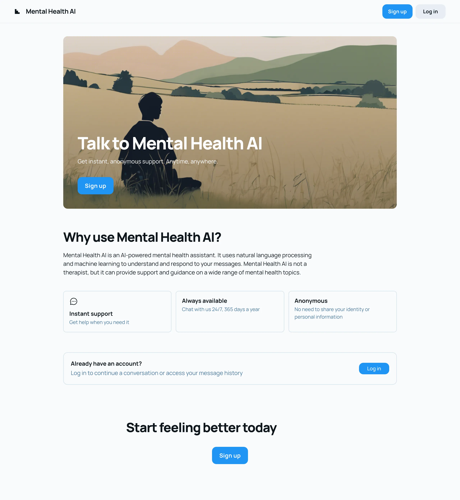

# 🧠 SENTIMI – Your AI Therapist Chatbot

SENTIMI is a mental wellness web application that offers compassionate, CBT-based (Cognitive Behavioral Therapy) conversations through an AI chatbot. Built with React on the frontend and powered by a fine-tuned GPT-2 model on the backend, SENTIMI helps users identify, understand, and reframe negative thought patterns in a safe and supportive environment.

---

## ✨ Features

- 🤖 **AI Therapist Chatbot**: Provides therapeutic responses rooted in CBT.
- 🧠 **Powered by Distilbert and GPT-2**: Fine-tuned to understand mental health prompts and provide structured, helpful guidance.
- 💬 **Natural Conversations**: Talk freely with the chatbot just like you would with a real therapist.
- 🔐 **Authentication System**: Sign up and log in securely to access your personalized dashboard.
- 📅 **Dashboard**: View past sessions, mood logs, and progress summaries.
- 💡 **Daily CBT Tips**: Get daily motivational prompts and therapeutic insights.

---

## 🚀 Tech Stack

| Technology | Description                                 |
| ---------- | ------------------------------------------- |
| React      | Frontend UI Framework                       |
| GPT-2      | AI Model (fine-tuned for CBT conversations) |
| DistilBERT | Classfication model for emotional analysis  |
| Node.js    | Backend API Server                          |
| HTML/CSS   | Styling and Layout                          |

---

## 📷 UI Snapshots

### 🏠 Home Page



### 💬 Chatbot Page


### 🔐 Login Page


### 📝 Signup Page


### 📊 Dashboard


---

## 🚀 How to Run the distilbert-emotion Model

This project uses a fine-tuned distilbert-base-uncased model for emotion classification. To run the model locally:

1. Install dependencies
   ```
   pip install transformers torch
   ```
2. Then simply run:
   ```
   python model/run_distilbert_emotion.py
   ```
3. Wait a few seconds for the model to download. Once it's ready, you’ll see:
   ```
   >>
   ```
4. Type your input message after the prompt. Example:
   ```
   >> I am feeling stressed today
   Predicted Emotion: anxious
   >> I am feeling good
   Predicted Emotion: confident
   >> He feels awful
   Predicted Emotion: guilty
   ```

---

## 📂 Project Structure

```
SENTIMI/
├── public/
├── src/
│   ├── components/             # Chat, Navbar, Auth components
│   ├── pages/                  # Home, Chatbot, Login, Signup, Dashboard
│   ├── assets/                 # Images, styling
│   ├── App.js
│   ├── index.js
├── backend/ (optional)         # GPT-2 API or authentication server
├── model/                      # Fine-tuned GPT-2 files and scripts
├── dataset/
|   ├── empatheticdialogues/    # Open source Empathetic Dialogues dataset
├── README.md
```

---

## 🧠 How It Works

1. The user interacts with a chatbot through a React frontend.
2. Messages are sent to a backend server hosting a fine-tuned GPT-2 model.
3. The model generates CBT-based therapeutic responses.
4. User history and mood logs are optionally saved and shown in the dashboard.

---

## 🛠️ Installation

### Frontend Setup

```bash
git clone https://github.com/yourusername/sentimi.git
cd sentimi
npm install
npm start
```

### Backend Setup (for GPT-2 API)

no setp right now

---

## 🚀 Future Enhancements

- Mood tracking and journaling features
- Therapist feedback integration
- Emotion detection and sentiment analysis
- Data export and report generation

---

## ❤️ Contributing

Contributions are welcome! Feel free to fork the repo, make your changes, and submit a pull request. For major changes, please open an issue first to discuss what you’d like to do.

---


> **Disclaimer:** SENTIMI is an AI-powered support tool and is not a substitute for licensed mental health professionals. For serious concerns, always seek professional help.
